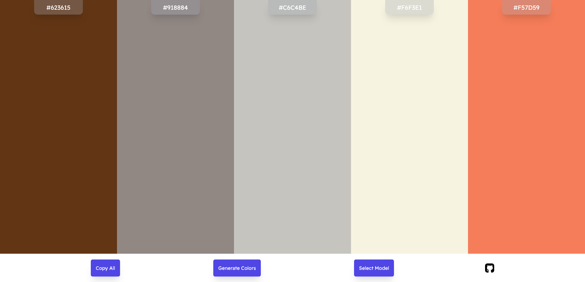

# DevProjects - Build a screenshot pipeline

This is an open source project from [DevProjects](http://www.codementor.io/projects).
Project is based on Vue and uses ColorMind API to generate colors.

## Tech/framework used

Built with `Vue JS`

## Screenshots



## Installation

```bash
npm i
```

## License

[MIT](https://choosealicense.com/licenses/mit/)
Most open source projects use the MIT license. Feel free to choose whichever license you prefer.
